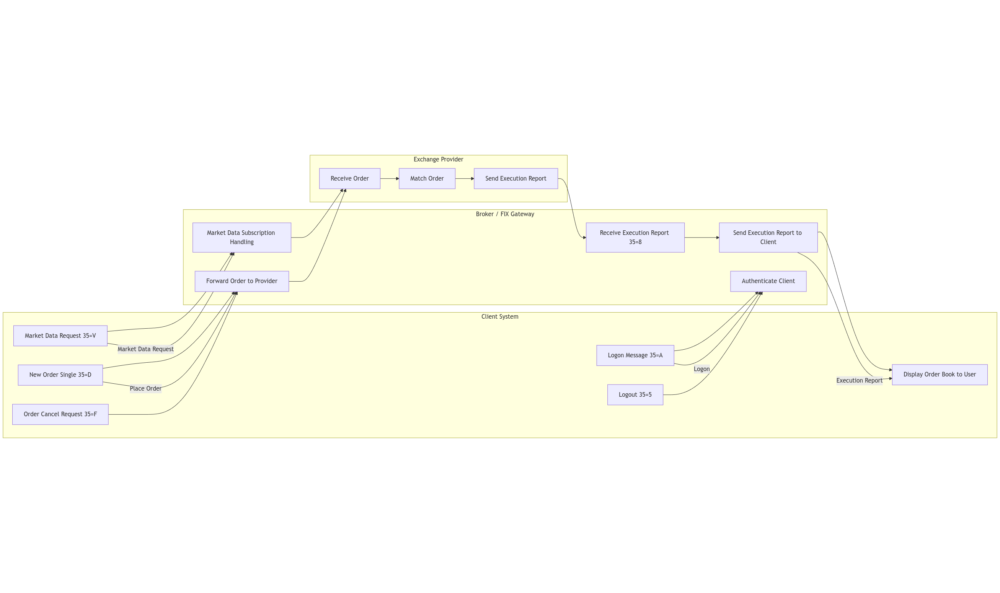

# go-fix-exchange
This project aims to build a backend system that can communicate with brokers via the [FIX (Financial Information eXchange)](https://www.fixtrading.org/what-is-fix/) protocol to:
* Authenticate clients
* Subscribe to market data (e.g., order book)
* Send trade orders (buy/sell)
* Receive execution reports
* Simulate or connect to real-world broker FIX gateways

## 🧠 Key Concepts
| Component          | Description   |
| -------------------|:-------------:|
|**FIX Protocol**    |A messaging standard for electronic trading between clients and brokers/exchanges|
|**Broker**          |The counterparty or gateway that routes client orders to the market|
|**Market Provider** |The source of liquidity (exchange, ECN, etc.)|
|**Execution Report**|A message (35=8) confirming trade status (filled, rejected, etc.)|
## 🧭 Architecture Flow

  

## 🚀 Features
- [ ] FIX session manager (Logon, Logout, Heartbeat, etc.)
- [ ] Market data request handler
- [ ] Order book display support (handle incremental refresh)
- [ ] Order placement (buy/sell)
- [ ] Order cancel / replace
- [ ] Execution report handler
- [ ] Mock broker for local testing
- [ ] Logging and auditing
- [ ] WebSocket for frontend updates
- [ ] Dockerized environment
- [ ] OpenAPI Spec / HTTP layer

---

**FIX Message Types Reference:**

| Feature                  | FIX Msg Type (Tag=35)    |
|--------------------------|--------------------------|
| MarketDataRequest        | V                        |
| NewOrderSingle           | D                        |
| OrderCancelRequest       | F                        |
| OrderCancelReplaceRequest| G                        |
| ExecutionReport          | 8                        |

## 📌 Milestones
### Phase 1 — Core FIX Engine
- [ ] FIX logon / heartbeat / logout
- [ ] Parse incoming FIX messages (market data, exec reports)
- [ ] Send outgoing FIX messages (orders, cancel, etc.)
### Phase 2 — Mock + Testing
- [ ] Implement mock broker (quickfix-go acceptor)
- [ ] Simulate order book and execution logic
- [ ] Unit test all message flows
### Phase 3 — Web + UI Integration
- [ ] WebSocket to push order book + trade updates
- [ ] HTTP endpoint to place simulated orders

## 🤝 Contribution
Feel free to fork the repo and submit a PR! If you're new to FIX or want to simulate your own broker setup — this project is for you.
